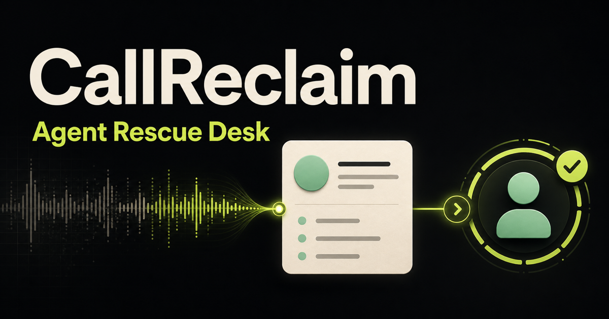

# CallReclaim — Agent Rescue Desk

CallReclaim is a synthetic missed-call recovery desk built for people and WebMCP agents to use together. An agent can compare several demo inquiries, open the exact transcript behind one lead, stage a fact-grounded reply, and queue that draft for an owner. The owner alone can review or discard it. There is deliberately no send tool.



This repository is the isolated WebMCP Challenge edition. It contains no production CallReclaim infrastructure, customer records, phone numbers, credentials, external APIs, authentication, tracking, or messaging capability.

## Live app

[Open the CallReclaim Agent Rescue Desk](https://callreclaim-agent-desk.yoosefseed.chatgpt.site)

## Why WebMCP

Missed-call recovery combines work that agents handle well—sorting, extracting details, and drafting—with a decision a business owner should retain. WebMCP lets the agent work through explicit page-owned actions in the same live desk the owner sees. Each tool reuses the visible app state, and every mutation is immediately inspectable.

The representative workflow is:

1. List the synthetic missed-call leads.
2. Select the urgent, consented inquiry.
3. Inspect its exact transcript and verified facts.
4. Stage an editable reply grounded only in those facts.
5. Queue the current draft revision for owner review.
6. Stop. Only the owner can review or discard the draft.

## Site tools

The top-level page registers exactly four imperative WebMCP tools with `document.modelContext.registerTool(...)`:

| Tool | What it does | Page effect |
| --- | --- | --- |
| `list_demo_leads` | Returns bounded synthetic lead summaries with urgency, consent, age, value, and status | Read-only |
| `inspect_demo_lead` | Opens one lead and returns its transcript and verified facts | Selects that lead visibly |
| `draft_owner_reply` | Validates consent, text bounds, and the supplied fact allowlist | Stages an editable, explicitly unsent draft |
| `queue_for_owner_review` | Requires the exact current draft revision | Moves the draft to the visible owner-review checkpoint |

Tool registration is feature-detected, page-scoped, cleaned up through `AbortSignal`, and never polyfilled. The ordinary interface remains usable in browsers without WebMCP.

## Safety properties

- Every business, person, value, transcript, and interaction is synthetic and visibly labeled.
- An unconsented lead cannot receive a draft.
- Drafts are limited to 480 characters.
- Every declared `factsUsed` entry must come from that lead's verified fact list; the owner still reviews the reply text.
- Queueing requires the current revision, preventing stale-write handoffs.
- The agent cannot approve, send, contact, submit, or publish anything.
- Reset restores the deterministic fixture state.

## Run locally

Requires Node.js `>=22.13.0`.

```bash
npm install
npm run dev
```

Open the local URL in the ChatGPT desktop app's built-in browser with site tools enabled. A useful demo prompt is:

> Compare the missed calls, inspect the highest-value consented lead, draft a concise reply using only verified facts, and queue it for my review. Do not claim to send anything.

## Verify

```bash
npm test
npm run lint
npm run build
```

The focused tests cover the shared workflow state machine, consent and fact constraints, stale revision rejection, the exact four-tool registration contract, a full agent workflow, and unsupported-browser behavior.

## Challenge-period work

CallReclaim's broader missed-call product concept and an earlier sample walkthrough predate the WebMCP Challenge. This repository was created during the challenge as a clean, public-safe extension. The new work here is the shared human-agent rescue desk, deterministic multi-lead fixture, imperative WebMCP surface, revision-gated owner handoff, focused tests, and standalone deployment.

## License

MIT. See [`LICENSE`](./LICENSE).
